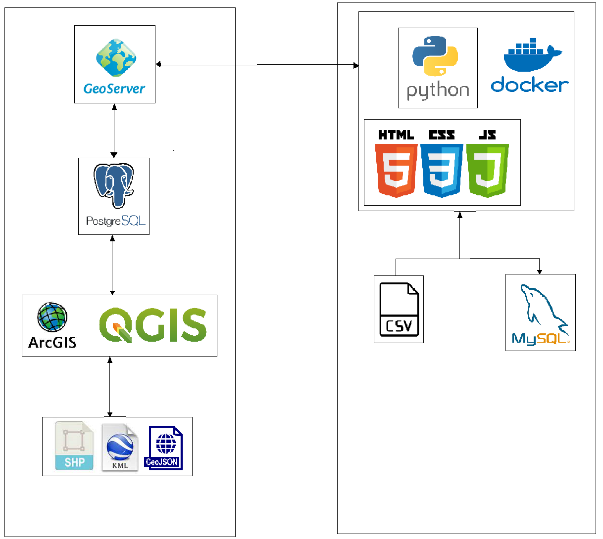
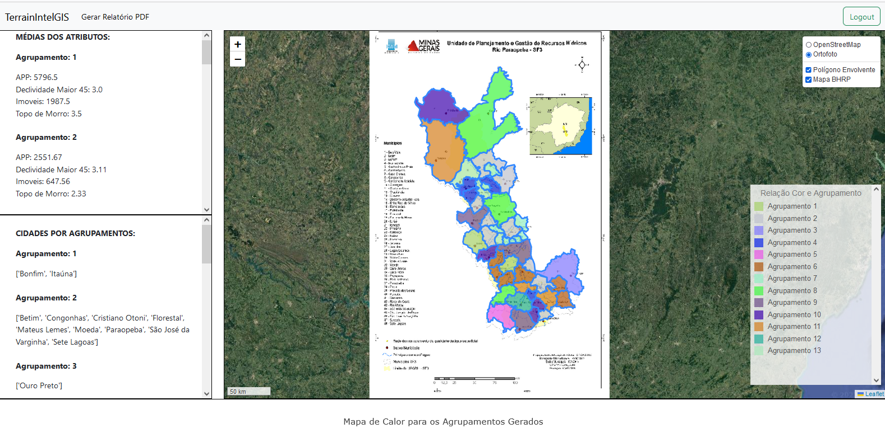
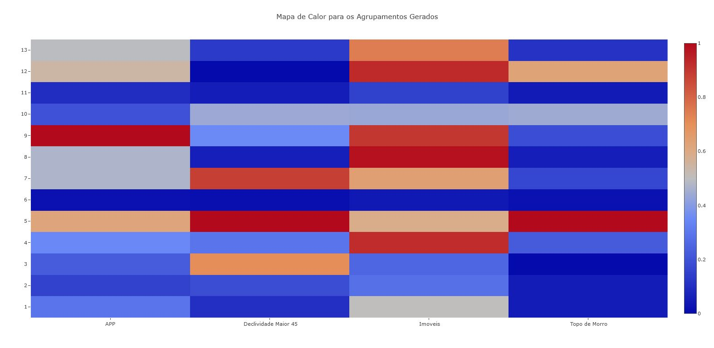

<h1>TerrainIntelGIS</h1>

Repositório dedicado ao Sistema de Inteligência Geográfica proposto no projeto do programa de mestrado em Ciência da Computação do Departamento de Informática (DPI) da Universidade Federal de Viçosa (UFV-MG).

<h2>Sumário</h2>
<ol>
  <li>Arquitetura</li>
  <li>Tecnologias Utilizadas</li>
  <li>Trabalhos Gerados</li>
</ol>

<h3>Arquitetura</h3>

A arquiteutra do sistema proposto segue o diagrama mostrado na Figura seguinte.

O sistema como um todo é dividido em dois módulo: o primeiro contém o <i>frontend</i> e o <i>backend</i> da aplicação, assim como o banco de dados responsável pela gestão dos usuários e demais funcionalidades. Enquanto isso, no segundo módulo há o servidor de mapas juntamente com o banco de dados responsável por sua alimentação.

<h3>Tecnologias Utilizadas</h3>

<i>Frontend</i>

<ol>
  <li>HTML</li>
  <li>CSS</li>
  <li>Javascript</li>
</ol>

<i>Backend</i>

<ol>
  <li>Python</li>
</ol>

Outros

<ol>
  <li>GeoServer</li>
  <li>Docker</li>
  <li>Postgres</li>
  <li>MySQL</li>
</ol>

<h4>Instalação</h4>

Para instalação do sistema é necessário ter o aplicativo Docker instalado.

Sendo assim, basta ir ao diretório "sistema/", onde está localizado o arquivo docker-compose.yml e dar o seguinte comando "docker-compose up". Com isso, 
será feito a instalação do Módulo 02 da aplicação. A configuração e instalação do Módulo 01 deverá ser feita na rede local do usuário.

<h4>Imagens do Sistema</h4>

<h3>Artigos Gerados</h3>

<a href="https://www.researchgate.net/publication/366988517_Uma_Metodologia_para_Apoio_a_Tomada_de_Decisao_em_Cenarios_de_Desastres_Ambientais_Utilizando_Dados_Publicos">Brumatti, C. H. T., Schaefer, M. A. R., Lisboa Filho, J., & Reis, J. C. (2022). Uma metodologia para apoio à tomada de decisão em cenários de desastres ambientais utilizando dados públicos. In GEOINFO (pp. 329-334).</a>

<a href="https://www.researchgate.net/publication/374409195_TerrainIntelGis_A_Geographic_Intelligence_System_to_Support_Decision-Making_in_Environmental_and_Natural_Disaster_Scenarios">Brumatti, C. H., Schaefer, M., Villela, M. L. B., Lisboa-Filho, J., & Reis, J. C. (2023, October). TerrainIntelGis: A Geographic Intelligence System to Support Decision-Making in Environmental and Natural Disaster Scenarios. In Anais Estendidos do XXIX Simpósio Brasileiro de Sistemas Multimídia e Web (pp. 89-92). SBC.</a>

