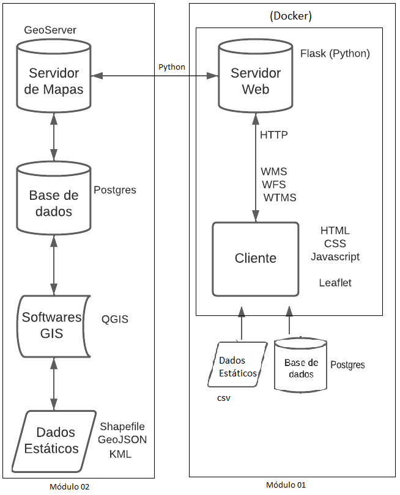

<h1>TerrainIntelGIS</h1>

Repositório dedicado ao Sistema de Inteligência Geográfica proposto no projeto do programa de mestrado em Ciência da Computação do Departamento de Informática (DPI) da Universidade Federal de Viçosa (UFV-MG).

<h2>Sumário</h2>
<ol>
  <li>Arquitetura</li>
  <li>Tecnologias Utilizadas</li>
</ol>

<h3>Arquitetura</h3>

A arquiteutra do sistema proposto segue o diagrama mostrado na Figura seguinte.

O sistema como um todo é dividido em dois módulo: o primeiro contém o <i>frontend</i> e o <i>backend</i> da aplicação, assim como o banco de dados responsável pela gestão dos usuários e demais funcionalidades. Enquanto isso, no segundo módulo há o servidor de mapas juntamente com o banco de dados responsável por sua alimentação.

<h3>Tecnologias Utilizadas</h3>

<i>Frontend</i>

<ol>
  <li>HTML</li>
  <li>CSS</li>
  <li>Javascript</li>
  <li>Leaflet</li>
</ol>

<i>Backend</i>

<ol>
  <li>Python</li>
</ol>

Outros

<ol>
  <li>GeoServer</li>
  <li>Docker</li>
  <li>Postgres</li>
</ol>
